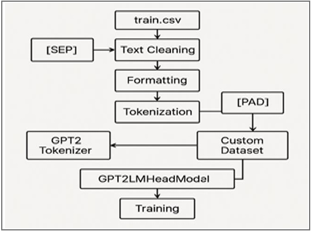
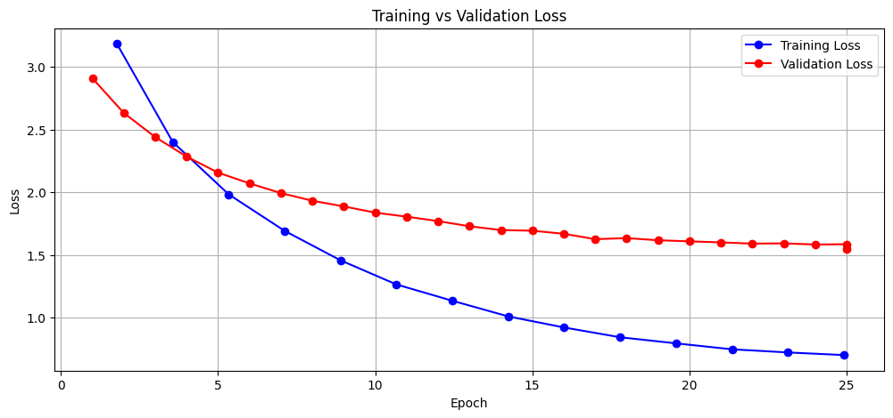

# 💬 GPT-2 Based Mental Health Support Chatbot

This project fine-tunes the GPT-2 transformer to create a chatbot capable of providing supportive and emotionally intelligent responses. It is designed to emulate compassionate conversational behavior for individuals facing mental stress or distress.

---

## 📌 Objective

To develop a **domain-specific conversational AI** that:
- Offers empathetic responses to users in distress.
- Is trained using GPT-2 on real-world supportive dialogues.
- Demonstrates how large language models can be tailored for mental health applications.

> 🧠 **Note:** This system is intended for research and educational purposes only. It is not a replacement for professional mental health care.

---

## 🔁 Data Pipeline



Here's how the data flows through the system:

Raw CSV → Cleaned → Tokenized → Encoded → Model Input

1. **Ingestion**: `train.csv` with two fields: `Context` and `Response`.
2. **Preprocessing**:
   - Clean whitespace, handle punctuation, lowercase (optional).
3. **Tokenization**:
   - GPT-2 tokenizer encodes both context and response into a single sequence.
4. **Encoding**:
   - Converted into input IDs with attention masks.
5. **Batched Loading**:
   - Custom PyTorch `Dataset` used for `DataLoader`.

---

## 🧠 Model Architecture

### 🔧 Base Model
- **GPT-2 (117M parameters)**: A transformer-based, autoregressive language model.
- Uses a unidirectional attention mechanism to generate text.

### 🧩 Adaptation Strategy
- Fine-tune the final few layers on conversational data.
- Use both context and response as input to predict next tokens.

---

## ⚙️ Training Details

- **Model**: `GPT2LMHeadModel` from HuggingFace
- **Tokenizer**: `GPT2Tokenizer`
- **Epochs**: 25
- **Batch size**: 10
- **Optimizer**: AdamW (default in Trainer)
- **Loss**: Cross-Entropy Loss (on language modeling objective)

### Sample Training Code

```python
trainer = Trainer(
    model=model,
    args=training_args,
    train_dataset=train_dataset,
    tokenizer=tokenizer
)
trainer.train()

### Checkpoints
Model checkpoints are saved every 500 steps to avoid loss during crashes and support resuming training.

### 🧪 Evaluation :
Evaluation of conversational AI is inherently challenging. Planned metrics include:

Perplexity: Lower perplexity implies more confident predictions.

Human Evaluation: Assess responses based on:
Empathy
Relevance
Coherence
Safety

Evaluation Loss:


ROUGE Score: 0.83
Measures the overlap of n-grams between generated and reference responses. A high ROUGE score indicates strong similarity in phrasing and vocabulary usage, suggesting the model generates relevant and contextually accurate replies.

BLEU Score: 0.71
Evaluates how closely the model-generated responses align with human-written responses based on precision of n-gram matches. A score of 0.71 reflects good alignment in language structure and semantics.

 ### 🎯 Deployment (Ideas)
While this repo focuses on training, deployment can include:

✅ Flask / Streamlit Web UI for user interaction.

🎙️ Integration with Speech-to-Text APIs for voice-based support.

🛠️ HuggingFace’s pipeline() API for inference-ready models.

🔄 Continuous fine-tuning via user feedback (RLHF - Reinforcement Learning with Human Feedback).

📊 Potential Visualizations
You can enhance presentation or UI dashboards with:

Wordcloud of most used terms in context/responses.

Bar chart comparing average response length before and after training.

TensorBoard for training loss visualization:
tensorboard --logdir=./logs

### 🚧 Challenges & Solutions
Challenge	Mitigation
Small Dataset	Consider using dialogue augmentation or semi-supervised data
GPT-2 Output Drift	Fine-tune over multiple epochs with early stopping
Long Inputs	Truncate or split long context-response pairs
Biased Outputs	Apply filtering or bias detection post-generation

### 🔬 Future Enhancements
🧠 Fine-tune larger models like GPT2-Medium or DialoGPT.

⏳ Enable multi-turn conversation support.

🌐 Add multilingual capabilities using translation pipelines.

📥 Incorporate real-time feedback to improve response quality.

🧑‍⚕️ Collaborate with mental health experts to validate safety and tone.

### 🧵 Example Use Case
Scenario:

User: "I feel like no one understands me anymore..."
Chatbot: "I hear you. It's completely okay to feel that way. Would you like to talk more about what you're going through?"

This reflects the model's ability to provide a human-like, empathetic reply by leveraging transfer learning from GPT-2 and task-specific fine-tuning.

### 📂 File Structure

mental-health-chatbot/
│
├── train.csv                # Dataset (context/response)
├── training.ipynb           # Model training notebook
├── results/                 # Model checkpoints
├── logs/                    # Training logs for TensorBoard
├── README.md                

###🛠 Tech Stack
Python 3.10+

PyTorch
Transformers (HuggingFace)
Jupyter Notebooks
Pandas
TensorBoard 

### 💭 Summary
This project showcases how transformer models like GPT-2 can be adapted into task-specific applications like mental health chatbots. It combines modern NLP techniques, transfer learning, and responsible AI use-cases to help demonstrate the power of fine-tuned LLMs.

